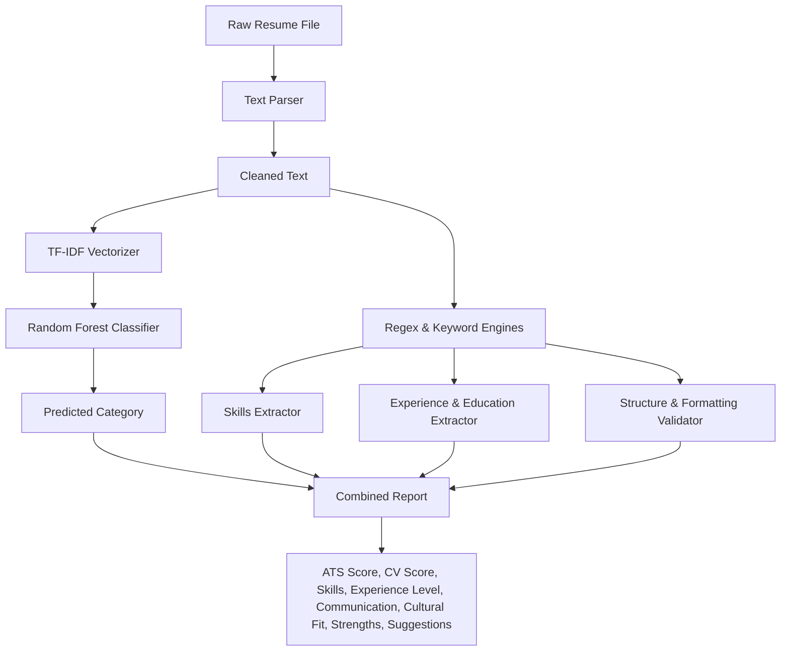

# CV Analysis Engine Documentation

This document describes the design and calculation methodologies of the **CV Analysis Engine**. The engine uses a **hybrid approach** combining Machine Learning (for job category classification) and Rule-Based logic (for structural, technical, and qualitative assessments).

---

## 1. Hybrid Architecture Overview

The CV Analysis Engine is designed to extract structural features and semantics from resume files (PDF, DOCX, TXT) and run them through two evaluation layers:
1. **Machine Learning Layer:** Uses a TF-IDF text representation fed into a trained Random Forest Classifier to categorize the resume into one of 25 distinct job roles.
2. **Rule-Based Layer:** Analyzes the vocabulary, patterns, and structural layout using regex and keyword dictionaries to calculate various performance indicators.

---

## 2. Machine Learning Layer: Category Prediction

* **Model Used:** Random Forest Classifier (`resume_classifier.pkl` + `vectorizer.pkl` + `label_encoder.pkl`)
* **Vectorization:** TF-IDF with sublinear scaling, mapped to a maximum vocabulary size of 5,000 features.
* **Process:**
  1. The raw text is stripped of URLs, email addresses, HTML/RTF tags, digits, and special characters.
  2. The text is tokenized, converted to lowercase, and filtered to remove English stopwords.
  3. Words are lemmatized to their base form using NLTK's `WordNetLemmatizer`.
  4. The TF-IDF vectorizer transforms the text, and the classifier predicts the encoded class index.
  5. The label encoder maps the class index back to the human-readable job category (e.g. *Java Developer*, *Data Science*, *DevOps Engineer*).

---

## 3. Rule-Based Layer: Score Calculations

### 3.1. CV Score (Overall Score)
The overall CV Score represents the candidate's alignment with professional standards, technical depth, and educational level. It is calculated as a weighted average:

$$\text{CV Score} = 0.4 \times \text{Skill Score} + 0.4 \times \text{ATS Score} + 0.2 \times \text{Education Score}$$

Where:
* **Skill Score:** $55 + 5 \times N_{\text{skills}}$ (capped at 98).
* **ATS Score:** Calculated based on sections and contacts (see below).
* **Education Score:** Based on the highest degree detected:
  * PhD or Doctorate $\rightarrow$ 100
  * Master's Degree or MBA $\rightarrow$ 80
  * Bachelor's Degree $\rightarrow$ 60
  * High School or general Degree $\rightarrow$ 40

### 3.2. ATS Score
The ATS (Applicant Tracking System) Score evaluates if a resume is formatted in a way that ATS parsers can easily digest.
* **Base Score:** 60
* **Section Detections (+4 points per section found):**
  * Experience, Education, Skills, Projects, Certifications, Languages, Summary/Profile.
* **Contact Information (+4 points each):**
  * Email pattern match (e.g., `user@domain.com`).
  * Professional link pattern match (e.g., `linkedin.com/in/...` or `github.com/...`).
* **Technical Breadth (+4 points):**
  * At least 5 technical skills detected.
* **Maximum Score:** 100

### 3.3. Technical Skills
* **Extraction Method:** Token-based keyword matching using a predefined dictionary of tech stacks (`SKILLS_KEYWORDS`).
* **Implementation:** Uses word boundary regex patterns (`\bkeyword\b`) to avoid substring false positives (e.g., preventing "Go" from matching "good" or "Django" matching "django-auth").
* Returns a list of all identified technical skills, which are then shown on the candidate profile.

### 3.4. Communication Score
The Communication Score reflects the candidate's ability to present their experience clearly, structure sections logically, and include standard communicative elements.
* **Base Score:** 70
* **Section-Based Additions (+5 points each):**
  * Summary/Profile section (indicates a concise value proposition).
  * Languages section (indicates multilingual capability).
  * Certifications/Organizations (indicates active professional communication).
* **Readability Adjustment:** Checks if experience points are bulleted using characters like `•`, `*`, or `-` (+5 points).
* **Maximum Score:** 100

### 3.5. Experience Level
The engine extracts the candidate's experience years by scanning for:
1. Regex pattern matches like `(\d+)\+?\s*years?\s+of?\s+experience`.
2. Date range matches in employment history (e.g., `2018 - 2022`, `2021 to Present`) and computing the duration.

The years of experience are mapped to the following standard levels:
* **Entry Level:** 0 - 2 years
* **Mid Level:** 3 - 5 years
* **Senior Level:** 6 - 9 years
* **Lead / Expert:** 10+ years

### 3.6. Cultural Fit Score
Cultural Fit is assessed by scanning the resume for keywords associated with agile team dynamics, leadership qualities, collaborative work environments, and work ethic.
* **Base Score:** 70
* **Keywords Checked (+5 points each, capped at 100):**
  * `agile`, `scrum`, `teamwork`, `collaborate`, `leadership`, `ownership`, `mentor`, `coordinate`, `manage`, `solved`.

---

## 4. Strength Analysis & Improvement Suggestions

These sections are generated dynamically to give candidates actionable feedback for optimizing their resume.

### 4.1. Strength Analysis (Max 3 items)
* **High Education:** Triggered if `EducationLevel >= 3` (Master/PhD) $\rightarrow$ *High Education Level (Master/PhD)*.
* **Deep Experience:** Triggered if `ExperienceYears >= 5` $\rightarrow$ *Strong Professional Experience*.
* **Broad Tech Stack:** Triggered if `SkillsCount >= 8` $\rightarrow$ *Broad Technical Skillset*.
* **ATS Compatibility:** Triggered if `ATS Score >= 80` $\rightarrow$ *Excellent ATS format compatibility*.
* *Fallback:* "Standard academic background" or "Relevant work history".

### 4.2. Improvement Suggestions (Max 3 items)
* **Missing Education:** If "education" section is not found $\rightarrow$ *Clearly outline your Education history in a dedicated section.*
* **Missing Skills Section:** If "skills" section is not found $\rightarrow$ *Structure your Technical Skills into a clean, scannable section.*
* **Missing Projects:** If "projects" section is not found $\rightarrow$ *Add a Projects section to showcase how you apply your skills.*
* **Low Skills Count:** If skills count is < 6 $\rightarrow$ *Incorporate more industry-relevant technical keywords and tools.*
* **Missing Links:** If LinkedIn/GitHub link is not found $\rightarrow$ *Add links to your professional profiles (LinkedIn or GitHub) in the header.*
* *Fallback:* "Quantify achievements (e.g., 'managed a team of 4' or 'optimized page load time by 30%')."
