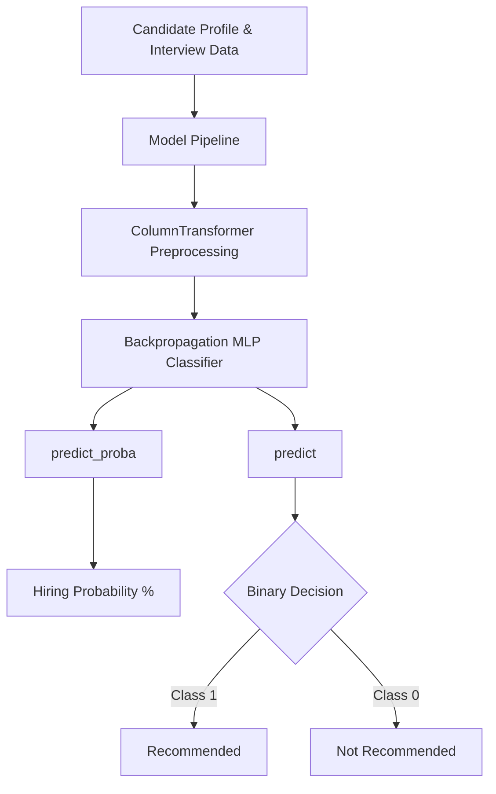

# Recruitment Model Engine Documentation

This document describes the design, features, and decision-making logic of the **Recruitment Engine** using the retrained Backpropagation (MLP Neural Network) classifier.

---

## 1. Core Model & Features

The recruitment engine predicts the final hiring decision using a 10-dimensional feature vector representing candidate demographics, scores, and recruitment details.

### 1.1. Feature Schema
The model receives a structured input vector with the following columns:

| Feature Name | Type | Value Range | Description |
| :--- | :--- | :--- | :--- |
| `Age` | Numerical | 20 - 50 | Age of the candidate. |
| `Gender` | Categorical | 0 (Female), 1 (Male) | Candidate's gender. |
| `EducationLevel` | Ordinal | 1 to 4 | 1: High School, 2: Bachelor, 3: Master, 4: PhD |
| `ExperienceYears` | Numerical | 0 - 15 | Years of experience. |
| `PreviousCompanies` | Numerical | 1 - 5 | Number of previous employers. |
| `DistanceFromCompany`| Numerical | 1.0 - 51.0 | Proximity to office. |
| `InterviewScore` | Numerical | 0 - 100 | Candidate's interview performance score. |
| `SkillScore` | Numerical | 0 - 100 | Score derived from skills extraction. |
| `PersonalityScore` | Numerical | 0 - 100 | Psychological or personality test score. |
| `RecruitmentStrategy`| Categorical | 1 (Referral), 2 (Job Board), 3 (Agency) | Application channel. |

---

## 2. Decision Logic: Probability and Recommendations

The engine applies the retrained Multi-Layer Perceptron (MLP) Pipeline (`recruitment_model.pkl`), which is trained using **Backpropagation**, to make inferences.

### 2.1. Hiring Probability
* **Calculation:** The probability is derived from the second column of the output from `predict_proba(X)`.
* **Formula:**
  $$\text{Hiring Probability} = \text{Probability(Class 1)} \times 100$$
* **Meaning:** It represents the Neural Network's confidence that the candidate will be a successful hire based on historical patterns in the dataset.

### 2.2. Hiring Recommendation
The binary recommendation is mapped directly from the model's `predict()` decision:
* **Recommended:** If the model predicts Class 1. This means the probability is $\ge 50\%$.
* **Not Recommended:** If the model predicts Class 0. This means the probability is $< 50\%$.

---

## 3. Training & Validation Performance
The model is trained on a dataset of 1,500 candidates. Key training metrics for the **Backpropagation Neural Network (MLP)**:
* **Accuracy:** 86.33% (Holdout Test Set)
* **Precision:** 81.71%
* **Recall:** 72.04%
* **F1-Score:** 76.57%
* **ROC AUC:** 0.9046 (high class separability)

